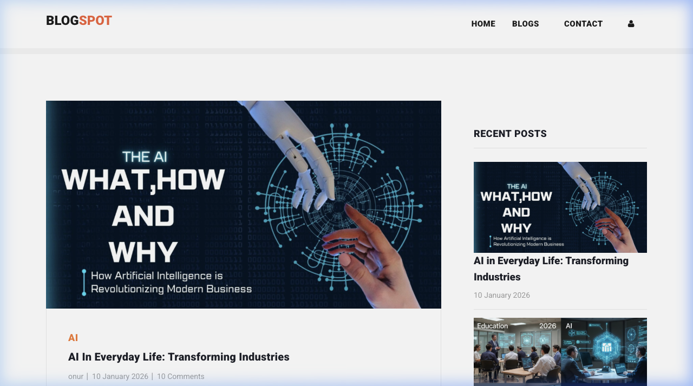
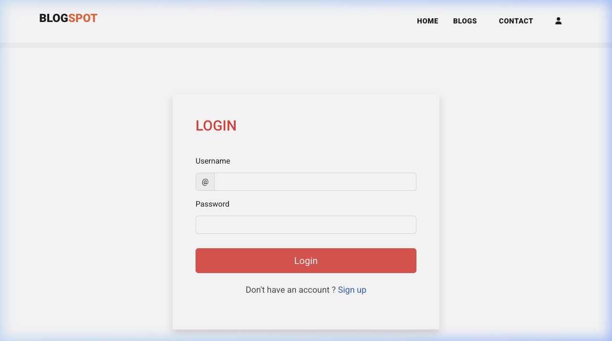

# BlogSpot - Django Blogging Platform

A full-featured blogging application built with Django and Bootstrap. This platform allows users to share their stories, interact with other posts, and manage their own content.

## 🌐 Live Demo

**[View Live App](https://blog.trihonor.com)** 🚀

## 📸 Screenshots

| Homepage | Blog Post Detail | Login |
|----------|-----------------|-------|
|  |  |  |

## 🚀 Features

-   **User Authentication**: Secure Sign Up, Sign In, and Logout functionality.
-   **Create & Manage Posts**: Users can create rich blog posts with images and categories.
-   **Interactive Community**:
    -   **Likes**: Show appreciation for posts.
    -   **Comments**: Engage in discussions on blog posts.
-   **Profile Management**: Customize your user profile.
-   **Responsive Design**: Built with Bootstrap 5 for a seamless experience on mobile and desktop.
-   **Cloud Integration**: Media files are stored and served via Cloudinary.
-   **Contact Form**: Integrated contact mechanism.

## 🛠️ Tech Stack

-   **Backend**: [Django](https://www.djangoproject.com/) (Python)
-   **Frontend**: HTML5, CSS3, [Bootstrap 5](https://getbootstrap.com/)
-   **Database**: PostgreSQL (Production) / SQLite (Development)
-   **Media Storage**: [Cloudinary](https://cloudinary.com/)
-   **Deployment**: Self-hosted on Raspberry Pi via Docker & Cloudflare Tunnels

## ⚙️ Installation & Local Development

Follow these steps to get the project running locally.

### Prerequisites

-   Python 3.8+
-   pip (Python package manager)
-   git

### 1. Clone the Repository

```bash
git clone <your-repo-url>
cd Blog_App_Python
```

### 2. Create and Activate a Virtual Environment

```bash
# Windows
python -m venv venv
venv\Scripts\activate

# macOS/Linux
python3 -m venv venv
source venv/bin/activate
```

### 3. Install Dependencies

```bash
pip install -r requirements.txt
```

### 4. Environment Variables

Create a `.env` file in the root directory (same level as `manage.py`) and add the following:

```env
DEBUG=True
SECRET_KEY=your_secret_key_here
ALLOWED_HOSTS=localhost,127.0.0.1
DATABASE_URL=sqlite:///db.sqlite3 # Or your local PostgreSQL URL
CLOUD_NAME=your_cloudinary_name
API_KEY=your_cloudinary_api_key
API_SECRET=your_cloudinary_api_secret
```

### 5. Run Migrations

```bash
python manage.py migrate
```

### 6. Start the Development Server

```bash
python manage.py runserver
```

Visit `http://127.0.0.1:8000` in your browser.

## 🌍 Self-Hosting (Docker & Raspberry Pi)

This project is self-hosted on a Raspberry Pi using Docker Compose and exposed publicly via a Cloudflare Tunnel — no open router ports required.

### 1. Docker Compose Setup

A `Dockerfile` and `docker-compose.yml` are included in the repository. The compose file spins up:
- The **Django Application** served via Gunicorn on port `8000`.
- A **PostgreSQL Database** on port `5432` with a persistent volume.

Start both services with:
```bash
docker compose up -d --build
```

### 2. Run Migrations & Collect Static Files

After the first launch, apply database migrations and collect static files:
```bash
docker compose exec web python manage.py migrate
docker compose exec web python manage.py collectstatic --noinput
```

### 3. Exposing via Cloudflare Tunnels

To serve the app publicly on a custom domain (e.g., `blog.trihonor.com`):
1. Navigate to your **Cloudflare Zero Trust** dashboard.
2. Go to **Networks > Tunnels** and configure your tunnel.
3. Under **Public Hostname**, map your domain:
   - **Type**: `HTTP`
   - **URL**: `127.0.0.1:8000`
4. Ensure `ALLOWED_HOSTS` and `CSRF_TRUSTED_ORIGINS` in `settings.py` include `blog.trihonor.com`.

## 🤝 Contributing

Contributions are welcome! Please feel free to submit a Pull Request.
